# Note2

> 2022.07.12-2022.07.13


## Part1. 论文复现

### 1. 思路总结

论文中给出了基于反馈的控制协议（feedback-based control protocol）的表达式，而复现内容为图像，需要将表达式“画”出来，故我们需要：

（1）根据论文了解各个量所表达的意义

（2）确定各个量的数据结构（使用python的numpy函数库定义）

（3）定义论文预设数据

（4）按时间顺序循环处理数据

（5）画图、标注、美化（使用pyplot函数库画图）

### 2. 部分实现

#### 2.1 定义数据

由于是连续的二维向量的列表，我们可以采用`np-array`数组存储。论文中leader的速度是不变的，位置会随着时间变化，与其他三辆车的变化有所不同，故将其单独定义为`vL_list`和`xL_list`，其余三辆车定义为`v_list`和`x_list`，而后还有期望车距，我们采取类似的形式定义为`r_or`，最后将列表中插入论文定义的初始数据即可，具体定义如下：

```python
r_or = [np.array([-5, 0]), np.array([-10, 0]), np.array([-15, 0])]
vL_list = [np.array([6, 0])]
v_list = [[np.array([9, 3]), np.array([8, 4]), np.array([10, 5])]]
x_list = [[np.array([16, 70]), np.array([10, 40]), np.array([6, 60])]]
xL_list = [np.array([20, 50])]
```

#### 2.2 定义表达式

> 注：这里先讨论没有链路断开的情况，有链路断开仅需改参数，不重复赘述

首先论文中给出了beta和gamma的值（均为1），我们需要定义a与k，由其定义可知a为邻接矩阵，当aij>0时，表示Vehical-i与Vehical-j有连接，当aij=0时表示Vehical-i与Vehical-j没有连接，这里不包含leader，同时由于这是无向有权图（aij=aji），我们便可将a定义为：`a = np.ones((3, 3))`

k表示follower是否与leader相连，显而易见将k定义为：`k = np.array([1, 1, 0])`，由于i与leader没有连接，为了使车队一体性更强，在这里将参数`k`乘以5（加强反馈），具体为`k = np.array([1, 1, 0]) * 5`

首先明确多项式的意义：
$$
\left\{\begin{matrix}
\dot{x}_{i}(t)=v_{i}(t)
 \\
\dot{v}_{i}(t)=\dot{v}_{L}(t)-\sum_{j=1}^{n}[({x}_{i}(t)-{x}_{j}(t)-{r}_{ij})+\beta({v}_{i}(t)-{v}_{j}(t))]-{k}_{i}[({x}_{i}(t)-{x}_{L}(t)-{r}_{i})+\gamma({v}_{i}(t)-{v}_{L}(t))]
\end{matrix}\right.
$$
位置等于初始位置加上速度对时间的积分，速度等于加速度的积分，复现要求速度和位置（均为复数）

```python
for t in range(0, times):
    v_temp = []
    x_temp = []
    for i in range(0, 3):
        # 处理累加部分所有Follower相对车距位移及速度反馈量
        v_temp_num = -1 * k[i] * (x_list[t][i] - xL_list[t] - r_or[i] + v_list[t][i] - vL)
        for j in range(0, 3):
            #处理ki后与Leader的位移及速度反馈量
            v_temp_num = v_temp_num - a[i][j] * (
                    x_list[t][i] - x_list[t][j] - r_or[i] + r_or[j] + v_list[t][i] - v_list[t][j])
        #速度 = 原速度 + 加速度 * 单位时间
        v_temp.append(v_list[t][i] + v_temp_num * step)
        #位置 = 原位置 + 速度 * 单位时间
        x_temp.append(x_list[t][i] + v_list[-1][i] * step)
    v_list.append(v_temp)
    x_list.append(x_temp)
    # Leader匀速运动
    xL_list.append(xL_list[-1] + vL * step)
    vL_list.append(vL)
```

### 3. 复现结果

绘图部分简单，不再赘述

#### 3.1 没有链路断开

a定义为：`a = np.ones((3, 3))`

位置变化：

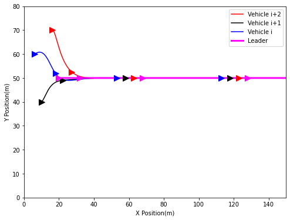

纵向间距变化：

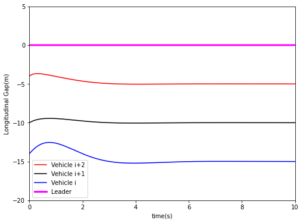

横向间距变化：

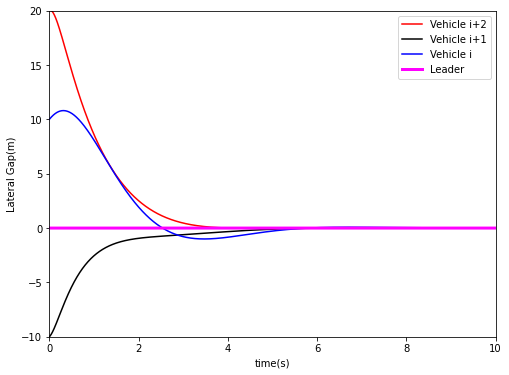

横向速度变化：

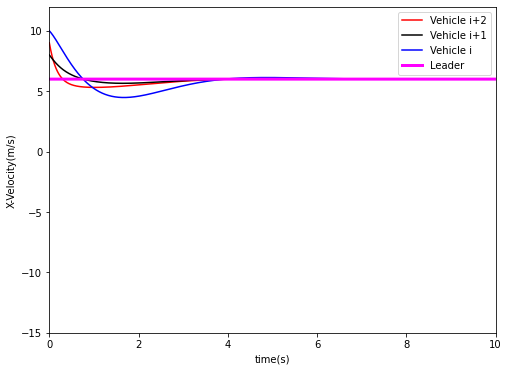

纵向速度变化：

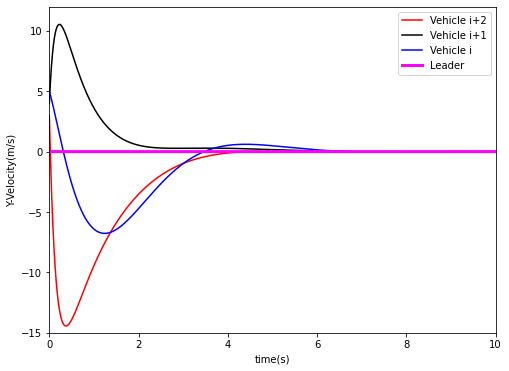

#### 3.2 Vehicle i断开

位置变化：

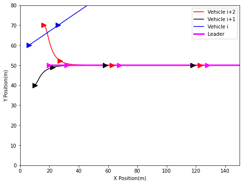

纵向间距变化：

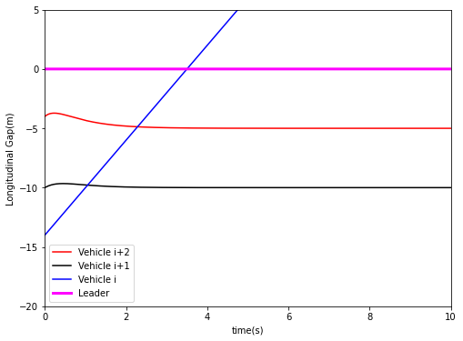

横向间距变化：

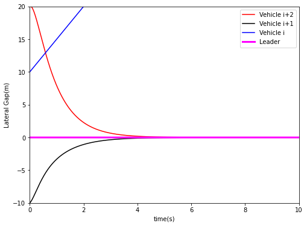

横向速度变化：

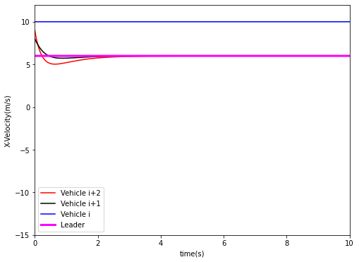

纵向速度变化：

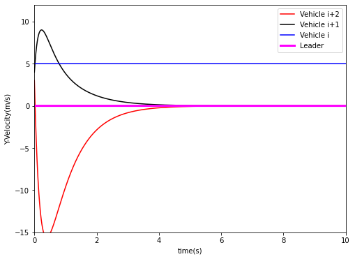

## Part2. 结论证明

首先由W.Ren的研究成果，我们可以将位置误差和速度误差分别定义为如下，此处均为两个方向的向量
$$
\tilde x_i(t)=x_i(t)-\mathbf{\mathit{1}}\int_{0}^{t}v_L(\tau)\mathrm{d}\tau-r_i，\tilde v_i(t)=v_i(t)-\mathit{1}v_L(t)  (1)
$$
其中下式是获取误差位置的辅助符号：
$$
\int_{0}^{t}v_L(\tau)\mathrm{d}\tau
$$
将（1）式代入2.2节式子，可得（4）式：

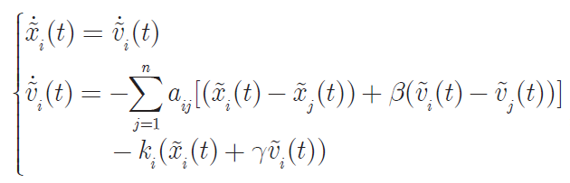

这里有两个知识点：

### 引理：拉萨尔不变集原理

#### 1. 不变集的定义

（1）如果系统从点x出发，那么系统未来的状态位置一直保持不变，一直待在出发点x，那么出发点x就叫做系统的不变点

（2）如果系统从某个区域内或者曲线出发上，例如以0为原点的半径为r的圆的区域或者有限环，系统的未来状态位置会一直待在该区域内(半径为r的圆内)或者曲线上，那么这个区域就叫做不变区

（3）所有这些不变点或者不变区域组成的集合，就叫做该系统的不变集

显然，我们可以知道，平衡点属于不变集，满足第1条；有限环（limit cycle）属于不变集，满足第2条；吸引域（domain of attraction）属于不变集，满足第2条；高维系统会出现不变环（invariant torus）和混沌吸引子(chaotic attractor)，满足第2条；整个无穷大的R^n ，因为不管怎么运动，发散还是稳定，都在R^n里

#### 2. La Salle's Invariance Principle

对于不依赖于时间的系统（autonomous system) `x'=f(x)` 其中 `f(x)` 连续，并且 `V(x)` 具有对 `x` 一阶连续偏导，如果满足以下条件：

（1） 在某个区域 `Ωl` 内 `V(x)<l(l>0)` （Vx具有上界）

（2） 在该区域内有：
$$
\dot{V}(x)=\frac{\partial V}{\partial x}f(x)\leq 0
$$
 把该区域内所有使得 `V‘(x)=0` 的点的集合叫做R，而M是包含在R内最大的不变集。如果系统起始于该区域内，那么随着 `t→∞` 系统一定会收敛于不变集M中的点

### 基于Lyapunov直接法进行控制算法的设计

大体上分为两种思维：

（1）第一种思维：先提出控制算法u，再找到到V(x)满足Lyapunov函数与稳定性判别和La Salle不变集原理与渐近稳定文中的稳定性条件

（2）第二种思维：先找到V(x)，然后设计控制算法u使得满足Lyapunov函数与稳定性判别和La Salle不变集原理与渐近稳定文中的稳定性条件

显然论文中采用的是第一种方法，我们继续证明：

由（4）式，Lyapunov 函数定义为（G.ZhiHong论文得出）：

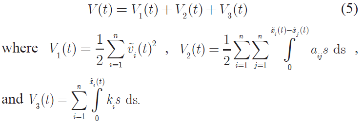

此时我们计算V1,V2,V3对时间的导数，再代入（5）式，可以得到V对时间的导数，同时由于是无向图，有：
$$
\tilde{v}_j \times \tilde{v}_i=\tilde{v}_i \times \tilde{v}_j
$$
同时再对其进行配方操作便可得到V’<=0：

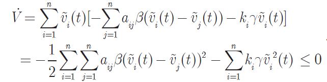

我们让V‘=0求极值，可以得到：

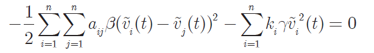

故而由于alpha、beta和k均大于等于零，两边同时乘以-1，可知：
$$
\tilde{v}_j = \tilde{v}_i,\dot{\tilde{v}}_j = \dot{\tilde{v}}_i=0
$$
将结论用于此部分第一条公式，可得（10）式：

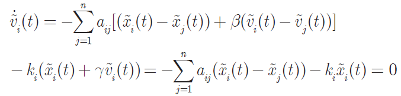

在（10）式前乘以xi(x)对i求和可得到：

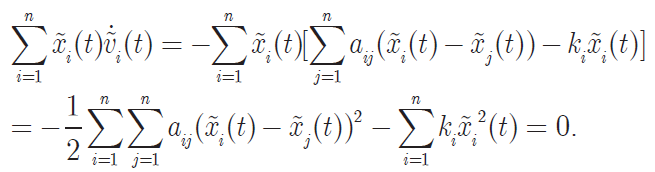

不难发现，这和上述为0证明有着异曲同工之妙，可以得出：
$$
\tilde{x}_i = \tilde{x}_j=0
$$
根据拉萨尔不变集原理（引理.2）的两个条件，我们知道其收敛于不变集中间的点，也就是leader车的位置加上期望间距的向量，速度则与leader一致，至此，证明结束