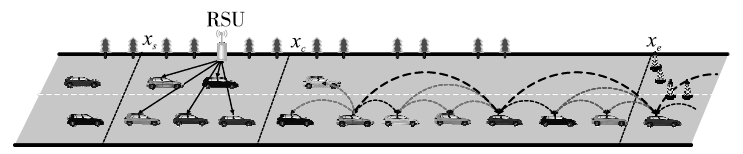
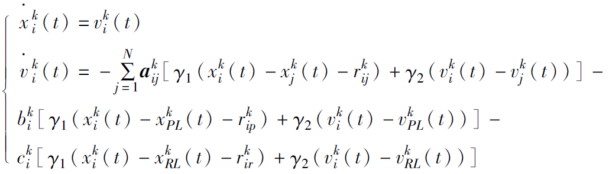
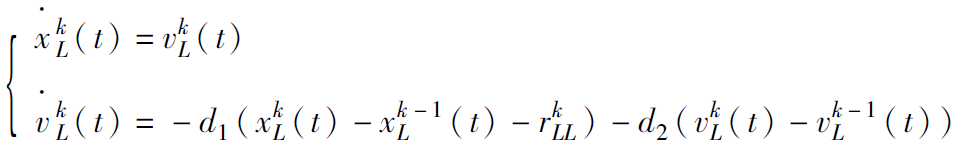
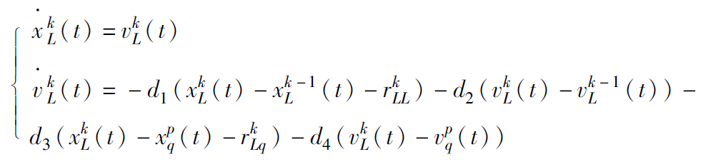
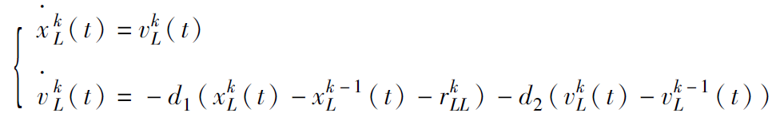
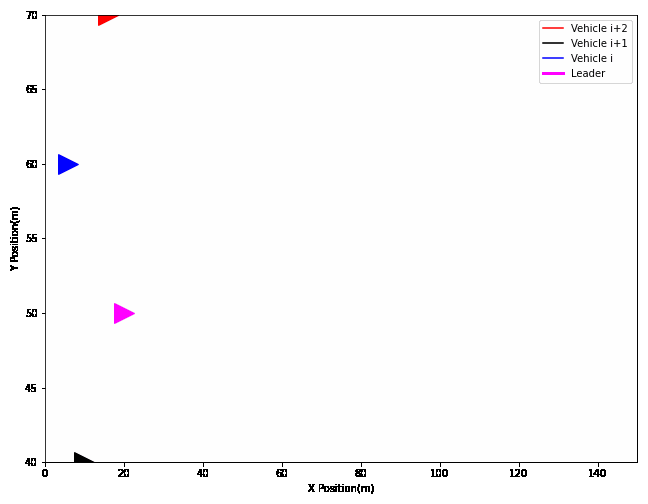

# Note

> 2022.07.14-2022.07.15


# Part1.论文阅读

**论文：基于多车辆集群的多编队一致性协议**

## 一、摘要及预备

### 1.1 摘要

​	本文针对多个车辆集群问题，借鉴多智能体领导跟随一致性的思想，提出了一个基于多车辆集群的多编队一致性协议，既保证车辆集群内部车辆状态的一致性，又保证车辆集群间车，辆状态的一致性，以实现多个车辆集群的协同控制。

### 1.2 定义变量

（1）加权有向图Gn=[Vn,En]，用于描述跟随者车辆之间的通信拓扑结构，其中Vn={1,2,...,n}表示节点，En是边的集合（包含于点的笛卡尔积）

（2）有向图Gn+1=[Vn+1,En+1]，用于描述领导者车辆与跟随者车辆的通信关系，节点与边集与上面类似

（3）Gn对应的邻接矩阵有两种情况：如果有连接，aij=1，无连接aij=0（Gn没有环）

（4）节点领域集Ni（相连接的所有j）

（5）节点入度矩阵Dn

（6）rij=(j-i)*S，类似第一篇文章的期望距离

（7）对应Gn的拉普拉斯矩阵Ln=Dn-An

（8）K为连接矩阵，用于描述跟随者车辆获取领导者车辆信息情况，ki>0本文均认为ki=1时车辆i能获取领导车信息

### 1.3 问题描述

​	当多车道变为双甚至单车道时很容易造成拥堵，但是早期变道能够延迟或消除瓶颈处拥塞（但由于总容量还是减少，所有依旧可能会拥塞）



Xs前：自由跟车

Xs后：与RSU通信，确定领导者，RSU首先判断范围内有无领导车：

​			有：给出领导车定位

​			无：判断是否有领导条件，没有发送建议，有则直接分配

Xc前：完成集群编队，领导车与前一个车群联系

Xe处：车辆减少口

## 二、协议设计

### 2.1 集群内协议

​	对于集群k的跟随车，参考前跟随车、k领导车、k后领导车，故由传统领导跟随一致性协议，将第二部分的反馈（领导车）分为两部分，也就是由k领导车、k后领导车决定，对于纵向协议可得下式：



对于横向协议，由于车队内横向仅需与领导车对齐，故不需要参考跟随车和后领导车，如下：



特别地，PL为前领导车，RL为后领导车，此外上述两式剩余参数与第一篇论文类似，不过多赘述

### 2.2 集群间协议

​	由于集群间也需要排序，集群领导车会参考前一个集群的领导车（整体一致）和前后跟随车（局部一致），如果领导车加速，则防碰撞车则选为前一个集群最后一个跟随车（加速追前面的尾），如果领导车减速，则选为该集群第一个跟随车（减速被追尾）

纵向协议：



横向协议：



特别地，rkLL是集群k与集群k-1领导车之间的期望间距，rkLq是集群k与防撞车的参考车的期望间距，d1>0，d2>0 表示不同集群中的领导车能够收到领导集群中的领导车辆状态信息，d3>0，d4>0 表示不同集群中的领导车能够收到碰撞避免车辆状态信息

# Part2. 动图模拟（补）

动图模拟需要用到matplotlib的animation，画图函数主要思想在于每个时间片画出图像的一部分，即 `[:time*100]` ，由此可知，若要画出完整图像，时延 `200 * 100 > len(list)`，最后将plt的figure、画图函数、时延传入FuncAnimation，代码如下：

```python
import matplotlib.animation as ani

def chart_func(time):
    plt.cla()
    plt.plot([i[0] for i in x1_list[:time * 100]], [j[1] for j in x1_list[:time * 100]], c="red")
    plt.plot([i[0] for i in x2_list[:time * 100]], [j[1] for j in x2_list[:time * 100]], c="black")
    plt.plot([i[0] for i in x3_list[:time * 100]], [j[1] for j in x3_list[:time * 100]], c="blue")
    plt.plot([i[0] for i in xL_list[:time * 100]], [j[1] for j in xL_list[:time * 100]], c="magenta", linewidth=3.0)
    plt.plot(x1_list[time * 100][0], x1_list[time * 100][1], '>', c="red", markersize=20)
    plt.plot(x2_list[time * 100][0], x2_list[time * 100][1], '>', c="black", markersize=20)
    plt.plot(x3_list[time * 100][0], x3_list[time * 100][1], '>', c="blue", markersize=20)
    plt.plot(xL_list[time * 100][0], xL_list[time * 100][1], '>', c="magenta", markersize=20)
    plt.xlabel("X Position(m)")
    plt.ylabel("Y Position(m)")
    plt.legend(["Vehicle i+2", "Vehicle i+1", "Vehicle i", "Leader"])
    plt.xlim([0, 150])
    plt.ylim([40, 70])
    plt.tight_layout()
    print(str(time/2) + "%")


fig = plt.figure(figsize=(9, 7))
an = ani.FuncAnimation(fig, chart_func, 200)
an.save("chart.gif")
```

效果如下：


