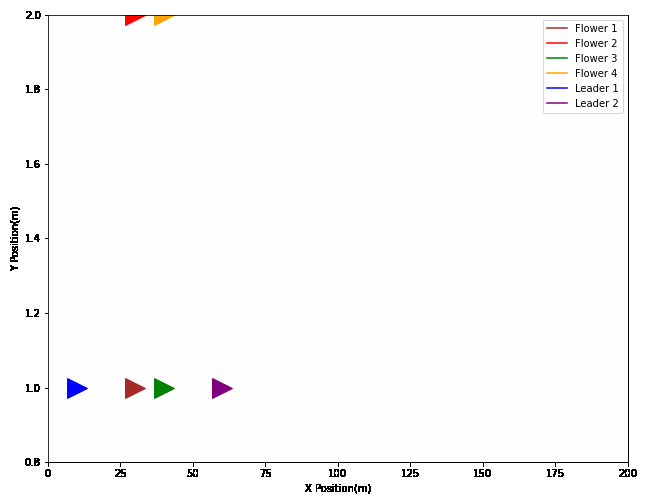
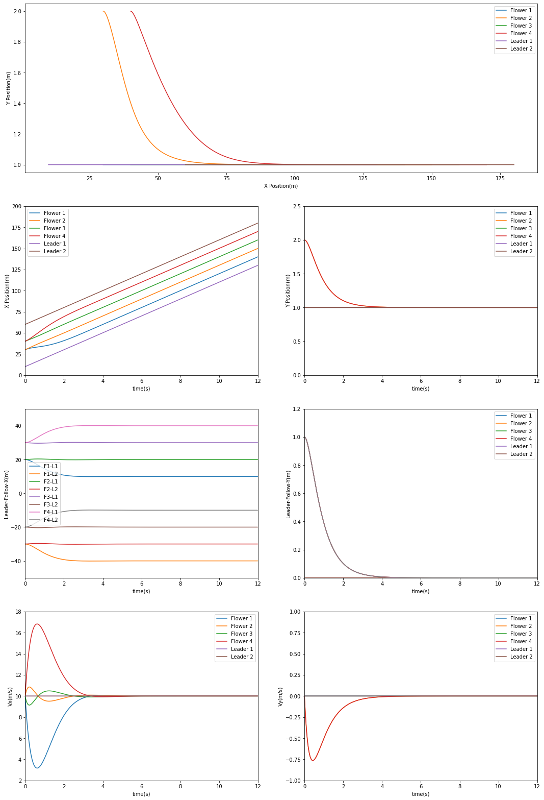
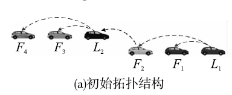
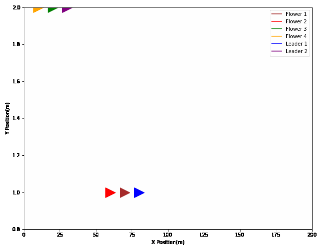
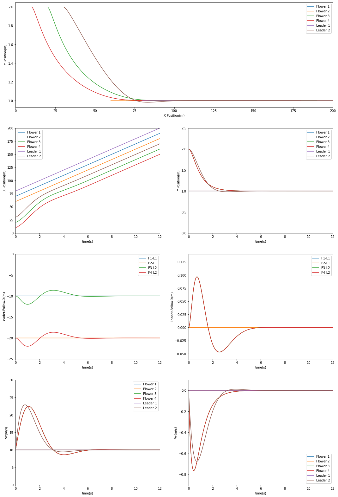
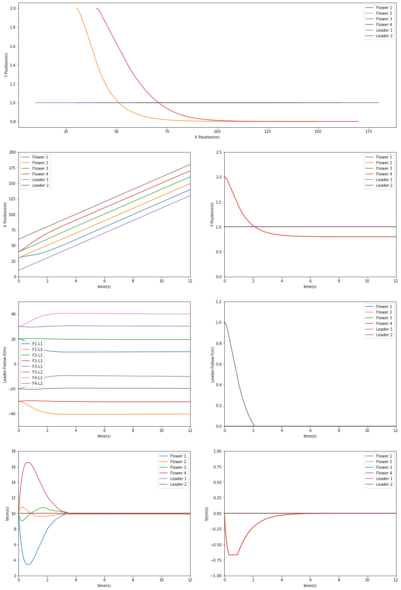
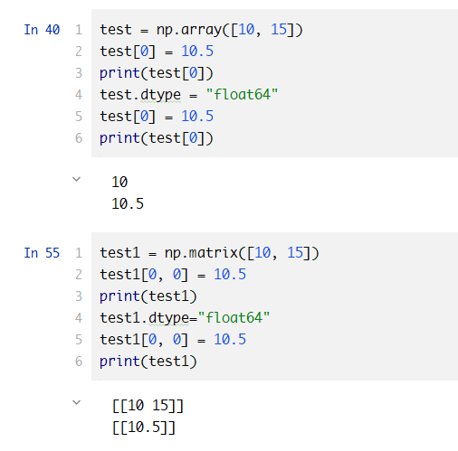

# Note

> 2022.07.16-2022.07.17

**论文：基于多车辆集群的多编队一致性协议**


## Part1. 实验一复现

### 1. 复现思路

实验一是集群内领导跟随一致性协议设计，通俗来说就是集群内的车怎么走，类似第一篇论文，我们需要根据论文了解各个量所表达的意义、确定各个量的数据结构、定义论文预设数据、按时间顺序循环处理数据、画图、标注、美化、定义chart_draw函数画动图

### 2. 数据定义

依据实验所给的初始数据，我们分别定义rP与rR为前后Leader与Follower1、2、3、4的期望间距、x_list为Follower的位置数据（按时间step排序）、v_list为Follower的速度数据、xL_list为Leader1（前）与Leader2（后）的位置数据、a为Follower的通信链路情况（是否能互相获取速度位置数据）、b与c分别为是否能接收到前后Leader的控制指令，具体如下：

```python
# P为前，R为后
rP = [np.array([10, 0]), np.array([20, 0]), np.array([30, 0]), np.array([40, 0])]
rR = [np.array([-40, 0]), np.array([-30, 0]), np.array([-20, 0]), np.array([-10, 0])]
# 顺序为F1 F2 F3 F4
x_list = [[np.array([30, 1]), np.array([30, 2]), np.array([40, 1]), np.array([40, 2])]]
v_list = [[np.array([10, 0]), np.array([10, 0]), np.array([10, 0]), np.array([10, 0])]]
# 顺序为L1(P) L2(R)
xL_list = [[np.array([10, 1]), np.array([60, 1])]]
vL_list = [[np.array([10, 0]), np.array([10, 0])]]
a = np.zeros((4, 4))
a[0][1] = 1
a[1][0] = 1
a[1][2] = 1
a[2][1] = 1
a[2][3] = 1
a[3][2] = 1
b = [1, 1, 1, 1]
c = [1, 1, 1, 1]
```

### 3. 定义表达式

位置等于初始位置加上速度对时间的积分，速度等于加速度的积分，复现要求速度和位置（均为复数）

```python
for t in range(0, times):
    # 为何要定义为浮点型最后会阐述原因
    v_temp = [np.array([0.0, 0.0]), np.array([0.0, 0.0]), np.array([0.0, 0.0]), np.array([0.0, 0.0])]
    x_temp = []
    for i in range(0, 4):
        # 纵向式0
        v_temp[i][0] = - b[i] * (gamma1_col * (x_list[t][i][0] - xL_list[t][0][0] - rP[i][0]) + gamma2_col * (
                v_list[t][i][0] - vL_list[t][0][0])) - c[i] * (
                               gamma1_col * (x_list[t][i][0] - xL_list[t][1][0] - rR[i][0]) + gamma2_col * (
                               v_list[t][i][0] - vL_list[t][1][0]))
        # 横向式1
        v_temp[i][1] = - b[i] * (gamma1_row * (x_list[t][i][1] - xL_list[t][0][1] - rP[i][1]) + gamma2_row * (
                v_list[t][i][1] - vL_list[t][0][1]))
        for j in range(0, 4):
            # 此处rij使用rPi-rPj代替
            v_temp[i][0] -= a[i][j] * (
                    gamma1_col * (x_list[t][i][0] - x_list[t][j][0] - rP[i][0] + rP[j][0]) + gamma2_col * (
                    v_list[t][i][0] - v_list[t][j][0]))
        x_temp.append(x_list[t][i] + v_list[t][i] * step)
        v_temp[i] = v_temp[i] * step + v_list[t][i]
    x_list.append(x_temp)
    v_list.append(v_temp)
    xL_list.append([xL_list[t][0] + vL_list[t][0] * step, xL_list[t][1] + vL_list[t][1] * step])
    vL_list.append(vL_list[t])
```

### 4. 复现结果

绘图部分简单，不再赘述

**动图模拟：**



**静态论文图片：**

以下图片是形成队列过程CAV的位置、间距差、速度，不难发现，CAV最终都会达到期望间距，速度都会收敛一致，按照预先设定的路径行驶



## Part2. 实验二复现

### 1. 复现思路

实验二是集群间领导车集群一致性协议设计，通俗来说就是两个集群整体应该怎么走，步骤与实验一类似，这里不再赘述

### 2. 数据定义

此处由于集群间的协议仅针对Leader，Follower还需要使用实验一的集群内领导跟随一致性协议，为了方便起见，我们将数据的定义格式不做更改，仅将其数据进行修正



特别地，如上图所示，我们还需根据此更改b及c数组，由于此处F1F2、F3F4的所属集群不同，我们还需要更改a矩阵，仅使集群内的Follower相互交换数据

```python
# 顺序为L1(P) L2(R)
xL_list = [[np.array([80, 1]), np.array([30, 2])]]
vL_list = [[np.array([10, 0]), np.array([10, 0])]]

# 顺序为F1 F2 F3 F4
x_list = [[np.array([70, 1]), np.array([60, 1]), np.array([20, 2]), np.array([10, 2])]]
v_list = [[np.array([10, 0]), np.array([10, 0]), np.array([10, 0]), np.array([10, 0])]]

# P为前，R为后
rP = [np.array([-10, 0]), np.array([-20, 0]), np.array([-40, 0]), np.array([-50, 0])]
rR = [np.array([20, 0]), np.array([10, 0]), np.array([-10, 0]), np.array([-20, 0])]

rLL = np.array([-30, 0])
rLq = np.array([-10,0])

a = np.zeros((4, 4))
a[0][1]=1
a[1][0]=1
a[2][3]=1
a[3][2]=1
b = [1, 1, 1, 1]
c = [0, 0, 1, 1]
d1 = d2 = d3 = d4 = 1
```

### 3. 定义表达式

此处基于集群内领导跟随一致性协议部分表达式不变，增添集群间的协议，同时由于L1领导的集群可以被认为是领导集群，故L1为匀速运动、相应的只有L2领导车需要变化，故我们这里仅写出L2的速度变化表达式即可，L1仅需要增添相同元素

```python
for t in range(0, times):
    v_temp = [np.array([0.0, 0.0]), np.array([0.0, 0.0]), np.array([0.0, 0.0]), np.array([0.0, 0.0])]
    x_temp = []
    for i in range(0, 4):
        # 纵向式0
        v_temp[i][0] = - b[i] * (gamma1_col * (x_list[t][i][0] - xL_list[t][0][0] - rP[i][0]) + gamma2_col * (
                v_list[t][i][0] - vL_list[t][0][0])) - c[i] * (
                               gamma1_col * (x_list[t][i][0] - xL_list[t][1][0] - rR[i][0]) + gamma2_col * (
                               v_list[t][i][0] - vL_list[t][1][0]))
        # 横向式1
        v_temp[i][1] = - b[i] * (gamma1_row * (x_list[t][i][1] - xL_list[t][0][1] - rP[i][1]) + gamma2_row * (
                v_list[t][i][1] - vL_list[t][0][1]))
        for j in range(0, 4):
            # 此处rij使用rPi-rPj代替
            v_temp[i][0] -= a[i][j] * (
                    gamma1_col * (x_list[t][i][0] - x_list[t][j][0] - rP[i][0] + rP[j][0]) + gamma2_col * (
                    v_list[t][i][0] - v_list[t][j][0]))

        x_temp.append(x_list[t][i] + v_list[t][i] * step)
        v_temp[i] = v_temp[i] * step + v_list[t][i]
    x_list.append(x_temp)
    v_list.append(v_temp)

    vL_temp = [np.array([0.0, 0.0]), np.array([0.0, 0.0])]
    xL_temp = []
    vL_temp[1][0] = - d1 * (xL_list[t][1][0] - xL_list[t][0][0] - rLL[0]) - d2 * (vL_list[t][1][0] - vL_list[t][0][0]) - d3 * (xL_list[t][1][0] - x_list[t][1][0] - rLq[0])  -d4 * (vL_list[t][1][0] - v_list[t][1][0])
    vL_temp[1][1] = -d1 * (xL_list[t][1][1] - xL_list[t][0][1] - rLL[1]) - d2 * (vL_list[t][1][1] - vL_list[t][0][1])
    vL_temp[1][1]*=5
    vL_temp[1] =  vL_temp[1]  * step + vL_list[t][1]
    vL_temp[0] = vL_list[t][0]
    xL_list.append([xL_list[t][0] + vL_list[t][0] * step, xL_list[t][1] + vL_list[t][1] * step])
    vL_list.append(vL_temp)
```

特别的，论文中没有表述，但经多次实验发现，若是纵向加速度不乘以5，无法达到下图同一运动的情况，也就是与实验一相似，我们需要加强纵向的反馈

### 4. 复现结果

绘图部分简单，不再赘述

**动图模拟：**



**静态论文图片：**

以下图片是形成队列过程CAV的位置、间距差、速度，不难发现，CAV最终都会达到期望间距，速度都会收敛一致，按照预先设定的路径行驶



## Part3. 复现中的错误分析

在复现实验一时，我遇到了一个棘手的问题，所有的表达式均正确，但得到了如下不符合预期的结果：



我们不难看出在y速度及x速度上，均存在突变现象（曲线不平滑），让我百思不得其解，而后对比论文1的复现，唯一不同之处在于论文一复现的速度列表是append进行添加，而论文二采用预先定义而后修改横纵速度的方式，于是联想到与预先定义好的nd-array有关，一开始定义的nd-array如下：

```python
v_temp = [np.array([0, 0]), np.array([0, 0]), np.array([0, 0]), np.array([0, 0])]
```

经过以下实验可以得出，在nd-array中，预先定义好的整形数据，经过浮点数据的修改会进行强制转型，将float转换为int类型，同时，若是进行dtype的数据强转，则其未更改类型的数据会直接被清空，这两项内容也存在于matrix中，而后联想到numpy底层为C语言，也不难推测其产生原因了



解决问题的方法是定义时就将nd-array定义为浮点类型，如下：

```python
v_temp = [np.array([0.0, 0.0]), np.array([0.0, 0.0]), np.array([0.0, 0.0]), np.array([0.0, 0.0])]
```

