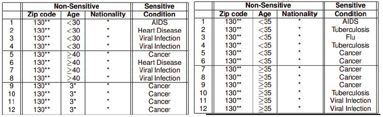
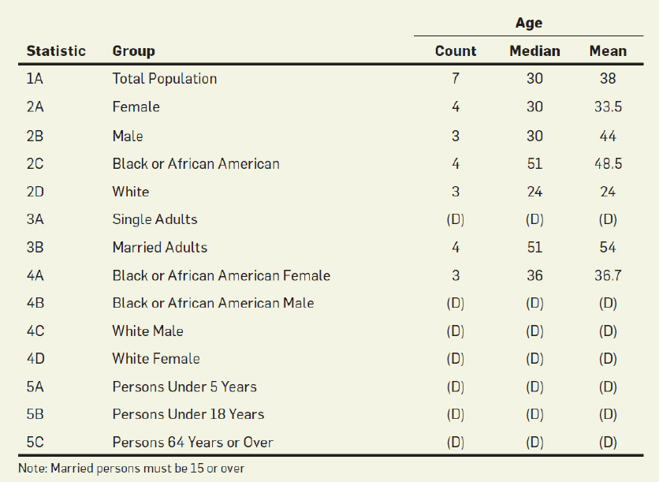
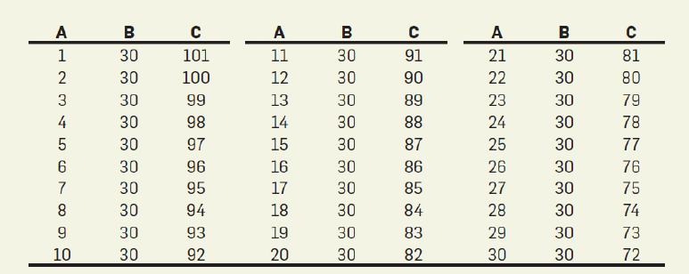
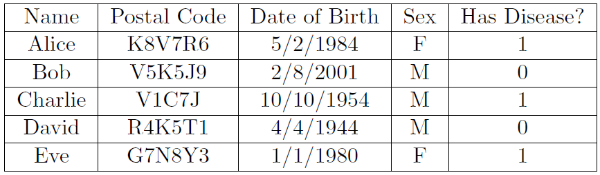

# 差分隐私Lecture

> 2022.07.20-2022.07.23
>
> Written By 思思不羡仙.

引言：由于觉得研究差分隐私论文还是不够透彻，打算将讲座也听一遍

## Lecture 1 数据隐私的尝试

### 1. 纽约市出租车数据

Chris Whong获取了包含2013年纽约市所有出租车票价和行程的数据并将其发布，JasonHall发现，编号为 CFC...A的人有许多不寻常的盈利，且这串编号与0的MD5一致，因此估计字段很短，故可以计算所有MD5再将其对应，若使用其他数据与之匹配（数据链接攻击），就可以将现实生活中的身份、收入、位置相匹配，造成隐私泄露

使用随机字符串是否可以解决这个问题？

若使用某出租车并记录时间和地点，便可推断字符串与司机的对应，依旧无法避免，不仅如此，还可以记录一个人的上车地点和时间，通过数据集推断其家庭住址

### 2. Netflix举办的竞赛

Netflix为了构建其推荐引擎，举办竞赛并提供了一个数据集（用户ID匿名），但如果将其对多部影片的评分与IMDB公共信息进行交叉对比以此来匹配用户数据，那么便可将IMDB的用户名与Netflix匿名ID进行关联，从而得到该用户的历史记录，造成隐私泄露

### 3. 神经网络的训练集

在文本语料库Y（可能包含敏感信息）上训练神经网络模型，并创建生成序列模型$f(θ)$，给定一个序列$x_1,x_2,...,x_n$，模型能够计算：

$$
P_\theta(x_1,...,x_n)=-\textrm{log}_2\textrm{Pr}(x_1,...,x_n|f_\theta)=\sum^{n}_{i=1}(-\textrm{log}_2\textrm{Pr}(x_i|f_\theta(x_1,...,x_n)))
$$

这个量$P_θ$被称为序列的对数困惑度（perplexity），如果社会安全代码（SSN）被分配了低困惑度，会出现两个问题

#### 3.1 两个问题

1. 训练的神经网络是否会记忆SSN
2. 若可以记忆，是否能获取SSN

#### 3.2 实验方法

My SSN is XXX（正确的）My SSN is XXX（错误的），对比上述两个句子是否有显著的困惑度区别，则可以判别是否被记住

#### 3.3 量化定义

设短语集合为$\R$，金丝雀的排名是在其中的索引（排序过），随机取 $r$（$\R$中元素）索引应在其中间，另一方面也说明，顶部元素为最有可能是要找的秘密，在如上定义下，$r \in \R$，则定义曝光率为：$\textrm{log}_2|\R|-\textrm{log}_2 \textrm{rank}(r)$，

#### 3.4 量化实验

如果在10亿个句子中插入几千次类似“My SSN is XXX”的句子，暴露率依旧很低，但如果数据集很小（例如10万），那么在插入4次后曝光率就很高了

> 另外两个例子与上述所讲重复，不记录

### 4. $k$-anonymity

至少有$k-1$个其他点具有相同的伪标识符设置，则数据集是$k$-anonymity

对比两幅图片，还是会存在以下问题（链接攻击）：

1. 假设我们知道我们 35 岁的朋友去过图 4 中左表对应的医院，那么我们就可以得出结论，他们患有癌症
2. 假设我们知道一个 28 岁的人访问了这两个表对应的医院：我们可以推断他们患有艾滋病

## Lecture 2 重建攻击

### 1. 裂解聚合

人口普查分层报告是一种聚合，注意，如下部分条目过少，为保护隐私故将其隐藏（D），但是这样无法保护全部隐私：

1. 通过多条冗余条目我们可以推断出被隐藏的内容：黑女人有三个，故可知黑男人有一个
2. 数据量较少可以进行推测：三位男性，设为ABC，通过中位数和平均数可以推测其可能结果为30种

虽然这是NP困难的，但使用SAT求解器和整数求解器可以很快解决，在2010年的美国人口普查中，使用上述方法可以在71%的人口中还原46%的微观数据，使用商业数据库按姓名可以识别5k万个人，这个结果影响很大

### 2. 全然非隐私以及*Dinur-Nissim*攻击

**一份数据：**

这其中Name，Post Code，Date of Birth，Sex均为公共信息，Has Disease为个人秘密信息，并将其定义为$d\in\{0,1\}^n$的n维向量

**两种角色：**

数据分析师：分析师可以指定$[n]$为查询子集，可以知晓其中有多少Has Disease=1的情况，也就是$S\in\{0,1\}^n$的n维向量（子集查询），在讨论Cohen-Nissim攻击时，真正的结果是$A(S)=d·S$

策展人：收到查询子集$S$，输出一个结果集$r(S)$，如果使得$r(S)=A(S)$，那么当子集大小为1时很容易获得个人隐私，故而需要在其中加入噪声$E$，定义为$|r(S)-A(S)| \le E$（此处的$E$是整体噪声），同时不要求$|r(S)-A(S)|$是随机分布的（可以输出$A(S)$在$E$内任何$R(S)$）

#### 2.1 定义一

如果攻击者可以构筑一个$c \in \{0,1\}^n$，使得除$o(n)$外的所有条目都与$d$相同，则该算法为全然非隐私的

全然非隐私意味着攻击者可以构筑一个与源数据库99%相似的数据库，我们称这种为重建攻击，并且很多通常都是全然非隐私的

#### 2.2 定理二

如果数据分析师允许请求$2^n$子集，并且策展人添加了一些有界$E$的噪声，那么根据结果，攻击者可以在除$4E$之外的所有位置重建数据库

特别地，如果$E=n/401$，那么攻击者可以在99%的条目上匹配真实数据库

此外，如果$E=o(n)$，那么该算法显然是全然非隐私的

证明简略来说：有$| \sum_{i\in I_0} c_i-r(I_0) | \le E$，同时有$| \sum_{i\in I_0} d_i-r(I_0) | \le E$，那么满足真实的$| \sum_{i\in I_0} c_i-d_i | \le E$则有$2E$的条目，对于$I_1$也一样，故而根据三角形两边之和大于第三边，整体最少相差有$4E$条目

#### 2.3 定理三

如果分析师被允许进行$O(n)$个子集查询，并且管理员添加了一些$E=O(α\sqrt{n})$，那么基于结果，计算效率高的攻击者可以在除$O(\alpha^2)$位置重建数据库

## Lecture 3 差分隐私简介

### 1. 随机响应

这里通过一个例子，假设分析师想要统计一个班里有多少个人作弊，有如下定义，$n$个人，个体$i$，隐私$X_i \in \{0,1\}$（此处代表是否作弊），每个人发出一条信息$Y_i$，其值与$X_i$有关，分析师想要获取$p=\frac{1}{n}\sum_{i=1}^{n}X_i$，有以下几种情况：

**情况一：完全没有隐私**

$$
Y_i = \left\{\begin{matrix}
 Xi \space \space \textrm{with probability 1}\\ 1-Xi \space \space \textrm{with probability 0}
\end{matrix}\right.
$$

由$\tilde{p}=\frac{1}{n}\sum_{i=1}^{n}Y_i$可以发现，由于$Y_i$与$X_i$相同，故而$\tilde{p}=p$

**情况二：完全没有统计意义**

$$
Y_i = \left\{\begin{matrix}
 Xi \space \space \textrm{with probability 1/2}\\ 1-Xi \space \space \textrm{with probability 1/2}
\end{matrix}\right.
$$

由$\tilde{Z}=\frac{1}{n}\sum_{i=1}^{n}Y_i$可以被表示为二项分布，其概率与统计量$X_i$毫无关联，是没有意义的

**情况三：随机响应**

为了使具有隐私的统计量$Y_i$不走向两个极端，这里新定义一种统计方法：

$$
Y_i = \left\{\begin{matrix}
 Xi \space \space \textrm{with probability }1/2 + \gamma\\ 1-Xi \space \space \textrm{with probability }1/2 - \gamma
\end{matrix}\right.
$$

在这里可以看到两种特殊情况：若是$\gamma=\frac{1}{2}$，那么这与情况一一致，若是$\gamma=0$，那么与情况二一致，其余情况则是择中，此处我们假设$\gamma=\frac{1}{4}$，那么大概率在询问$Y_i$时其值会等于$X_i$，这在一定程度上保护了隐私，我们继续分析

$$
E[Y_i]=2\gamma X_i+\frac{1}{2}-\gamma
$$

可以得到：

$$
X_i=E
\left [\frac{1}{2\gamma}(Y_i-\frac{1}{2}+\gamma)\right]
$$

则有：

$$
\tilde{p}=\frac{1}{n}\sum_{i=1}^{n}\left[\frac{1}{2\gamma}(Y_i-\frac{1}{2}+\gamma) \right]
$$

从上述式子可以看出：$E[\tilde{p}]=p$，接下来我们来分析其方差：

$$
\bold{Var}[\tilde{p}]=\bold{Var}\left[\frac{1}{n}\sum_{i=1}^{n}\left[\frac{1}{2\gamma}(Y_i-\frac{1}{2}+\gamma) \right]\right]=\frac{1}{4\gamma^2n^2}\sum_{i=1}^{n}\bold{Var}[Y_i]\le\frac{1}{16\gamma^2n}
$$

由上述可知，当$n$越大时，单个$\gamma$可以越小，也就是当样本数量大时，在某种程度上说隐私可以更好地被保护

### 2. 差分隐私

#### 2.1 定义

**直观：** 我们假设有$n$个个体，从$x_1$到$x_n$，每个人都有自己的数据点，他们将此点发送给“受信任的策展人”，其他人不知道具体数据点；给定策展人一个数据让他运行一个算法$M$，并公开输出结果，差分隐私是算法$M$的一个属性，表示没有任何单个人的数据对算法输出产生影响

**抽象：** 有一个算法$M:\Chi^n \rightarrow \Upsilon$，有两个数据集$X,X'\in \Chi^n$，其中两个数据集仅有一个值不同，我们将这对数据集也写为$X \sim X'$，我们称$M$是满足$ \varepsilon-$差分隐私，对于所有的相邻数据集$X,X'$且$T\subseteq \Upsilon$我们有：

$$
\textrm{Pr}[M(X)\in T] \le e^{\varepsilon}\textrm{Pr}[M(X')\in T]
$$

#### 2.2 一些技术评论

（1）差异隐私本质上是定量的，$\varepsilon$小的隐私保护性强

（2）$\varepsilon \in [0.1,5]$被认为是正常的，超出此范围的定义我们应抱有怀疑态度

