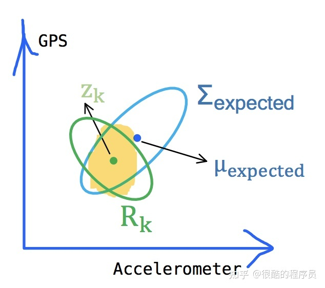

# Note

> 2022.07.22-2022.07.23

**论文：多智能体系统一致性问题研究**

> 引言：这篇论文大部分都是基本定理，这里记录一些两个推导过程

### 拉普拉斯矩阵

拉普拉斯矩阵表达形式： $L=D-A$

**定义：**

$A$：邻接矩阵

$D$：度矩阵

$f$：将图$G$看作一个包含$N$个变量的离散函数

$x_i$：节点i的取值

$N_i$：图中节点的一阶所有邻居节点集合，$j\in N_i$表示节点$i$的一个一阶邻居节点

**推导：**

$$
\begin{align}
\Delta f_{x_i}&=\sum_{j\in N_i}(x_i-x_j)\\
&=\sum_{j\in N}a_{ij}(x_i-x_j)\\
&=\sum_{j\in N}a_{ij}x_i - \sum_{j\in N}a_{ij}x_j\\
&=x_i\sum_{j\in N}a_{ij} - \sum_{j\in N}a_{ij}x_j
\end{align}
$$

注意到，$\sum_{j\in N}a_{ij}$可以看作第$i$个节点的度之和，也可以看作邻接矩阵$A$的第$i$行的$A_i$进行替换后：

$$
\begin{align}
&=x_iD_i-\sum_{j \in N}a_{ij}x_j\\
&=x_iD_i-A_iX
\end{align}
$$

单元素可以推导到整个矩阵，算子$\Delta f = DX-AX=(D-A)X$

### $Kalman$滤波器

假设我们有一台车子$x$，能知晓其速度及位置，将其表示为一个向量$\overrightarrow{x}=\begin{bmatrix}
 p\\v \end{bmatrix}$，此时我们肯定$x$的的状态，但由于系统存在误差，所以我们只能认为当前状态是当前真实状态的一个**最优估计**，那么我们不妨认为$x$的当前状态服从一个高斯分布：


其分布中心$μ$就是$\hat{x_k}=\begin{bmatrix}
\textrm{position} \\\textrm{velocity}
\end{bmatrix}$，对于方差$\delta^2$ ，因为我们有两个变量，所以可以用一个协方差矩阵$\bold{P}_k$表示：

$$
\bold{P}_k=\begin{bmatrix}
\sum_{pp}& \sum_{pv}\\\sum_{vp}& \sum_{vv}
\end{bmatrix}
$$

所以$x$的真实状态可能就位于上图椭圆的范围内，位于圆心的概率最大，通过$k-1$时刻的位置和速度，可以推测下一个时刻的状态为：

$$
\begin{align}
&p_k=p_{k-1}+\Delta tv_{k-1}
\\&v_k=v_{k-1}
\end{align}
$$

写成矩阵形式就是：

$$
\hat{x_k}=\begin{bmatrix}
1 & \Delta t \\ 
0 & 1 \\ 
\end{bmatrix}x_{k-1}=F_k\hat{x}_{k-1}
$$

此处的$F_k$为**状态转移矩阵**，系统误差通过协方差$P_k$表示，根据协方差特性：

$$
Cov(x)=\sum
\\Cov(Ax)=A\sum A^T
$$

那么我们所预测的$x$下一个时刻的状态误差为：

$$
P_k=F_kP_{k-1}F^T_{k}
$$

为了能让$x$到达任何地方，毫无疑问我们需要对它进行控制，比如加速和减速，假设某个时刻我们施加给$x$的加速度是$\bold{a}$那么下一时刻的位置和速度则应该为：

$$
\begin{align}
&p_k=p_{k-1}+\Delta tv_{k-1}+\frac{1}{2}a\Delta t^2
\\
&v_k= v_k-1+a\Delta t
\end{align}
$$

因此我们的状态预测方程更新为：

$$
\hat{x_k}=F_x\hat{x}_{k-1}+\begin{bmatrix}
\frac{\Delta t^2}{2}\\\Delta t
\end{bmatrix}a\\
=F_x\hat{x}_{k-1}+B_ku_k
$$

$B_k$称为**状态控制矩阵**，而$u_k$称为**状态控制向量**，含义很明显，前者表明的是加速减速如何改变$x$的状态，而后者则表明控制的力度大小和方向

同时在此考虑外部误差，设外部误差$w_k$服从均值为0高斯分布$w_k \sim N(0,Q_k)$至此我们就能得到Kalman滤波中完整的**状态预测方程**：

$$
\begin{align}
&\hat{x_k}=F_k\hat{x}_{k-1}+B_ku_k+w_k\\
&P_k=F_kP_{k-1}F_k^T+Q_k
\end{align}
$$



**卡尔曼滤波需要做的最重要的最核心的事就是融合预测和观测的结果，充分利用两者的不确定性来得到更加准确的估计**，通俗来说就是怎么从上面的两个椭圆中来得到中间淡黄色部分的高斯分布，看起来这是预测和观测高斯分布的重合部分，也就是概率比较高的部分

之后我们将两个高斯密度函数相乘，对比标准的高斯概率密度函数，相乘的结果是**一个乘了特定系数的新的高斯概率密度函数**，并且我们可以求解得到这个新的高斯分布的均值和方差分别为：

![[公式]](Note.assets/16586475460809.svg)

这里使用代码模拟：

```python
import numpy as np
import matplotlib.pyplot as plt
import math
from scipy.stats import norm

x = np.arange(-1, 2.5, 0.01)

mu0 = 0.3
mu1 = 0.8
sigma0 = 0.2
sigma1 = 0.5
sigma0_sq = 0.04
sigma1_sq = 0.25

y1 = norm.pdf(x, mu0, sigma0)
y2 = norm.pdf(x, mu1, sigma1)
y3 = y1 * y2

k = sigma0_sq / (sigma0_sq + sigma1_sq)
mu = (mu0 * sigma1_sq + mu1 * sigma0_sq) / (sigma0_sq + sigma1_sq)
sigma = math.sqrt((sigma0_sq * sigma1_sq) / (sigma0_sq + sigma1_sq))

scale = (1.0 / (math.sqrt(2 * math.pi * (sigma0_sq + sigma1_sq)))) * math.exp(
    -1.0 * ((mu0 - mu1) * (mu0 - mu1) / (2.0 * (sigma0_sq + sigma1_sq))))

y4 = norm.pdf(x, mu, sigma)*0.5

plt.plot(x, y1, x, y2, x, y3, x, y4)
plt.show()
```


那么我们把关注点放在这个乘积中这个新的高斯概率密度函数，其实它就描述了一个新的高斯分布，这正是卡尔曼滤波想要的**最优估计**

