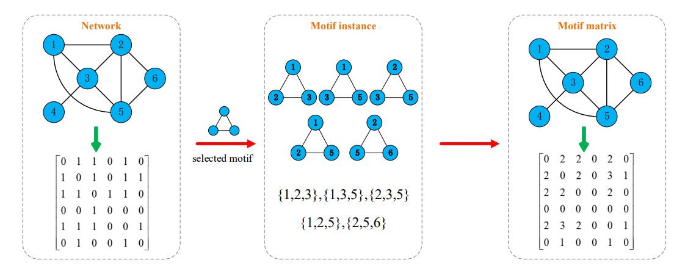

# MAS Note(1)

> Written By: 思思不羡仙
> Date: 2022.07.24-2022.07.25

**论文：Hybrid-Order Network Consensus for Distributed Multi-agent Systems**

> 此笔记部分Motif翻译为基元，类比生物学名词

## 一、摘要

#### 存在问题

只考虑了基于边缘连接模式的共识协议设计，忽略了可以展示节点之间的更多信息的高阶连接结构，例如基于一跳的共识协议难以发现周围的邻居节点

#### 解决办法

上述问题可以由Motif结构解决，Motif是具有代表性的在复杂网络中的高阶结构，例如，在社交网络中，由三个顶点和三个边组成的三角形Motif是建立社交关系的重要基础

在此之前，Motif主要用于分析生物学、工程学、社交媒体、统计关系学上，该论文亮点在于将其引入MAS中

## 二、基础知识

### 2.1 图和矩阵论

我们将多个节点的MAS定义为无向图$G=\{V,E,A\}$，$V$为顶点集，$E$为边集，$A$为领接矩阵，智能体$i$的邻居集合表示为：$N_i=\{j \in V|(i,j) \in E \}$，假设图$G$中不存在环（$a_{ii}=0$）,如果MAS中任意一对智能体是相互连接的，则称$G$为联通图，$G$的度矩阵定义为$D=\textrm{diag}\{d_i\}$，$d_i=\sum_{j \in N_i}a_{ij}$是顶点$i$的度，$|N_i|$是邻居节点的数目，拉普拉斯矩阵被定义为$L=D-A$

### 2.2 传统的离散共识协议

考虑一个多智能体系统有$n$个智能体，我们使用$G(t)=\{V,E(t),A(t)\}$来表示时间$t$的图结构，单个智能体$i$的状态值可以由$x_i(t)$表示，同时我们定义智能体只能在有限的范围$r_c$内交换数据，即邻居智能体集合为：$N_i(t)=\{j:||x_j(t)-x_i(t)||\le r_c\}$（第二范式）

#### 分布式共识算法

$$
x_i(t+1)=x_i(t)+\varepsilon \sum_{j \in N_i(t)}a_{ij}(t)(x_j(t)-x_i(t))
$$

$\varepsilon$为学习率，一般在$(0,\frac{1}{n}]$之间，若$j \in N_i(t)$，$a_{ij}(t)=1$，否则为0，该算法下的网络集体动态离散时间可以写为：
$$
X(t+1)=P(t)X(t)
$$
其中$P(t)=(I-\varepsilon L(t))$，其中$I$为单位矩阵，$L(t)$为时刻$t$拉普拉斯矩阵，$L(t)$有如下定义：
$$
L_{ij}(t)=\left\{\begin{matrix}\begin{align}
 |N_i(t)| &,i=j\\
 -1&,j \in N_i(t)\\
 0&,j \notin N_i(t)
\end{align}\end{matrix}\right.
$$
而后有人提出了另一种对于无向网络的离散时间共识算法：
$$
x_i(t+1)=\frac{1}{1+{|N_i(t)|}}(x_i(t)+\sum_{j \in N_i(t)}x_j(t))
$$
写成矩阵的形式：
$$
X(t+1)=(I+D(t))^{-1}(I+A(t))X(t)
$$
拓扑连通性与智能体之间的距离相关，若两者小于某一阈值，说明其连通（若是状态值相近，其可互相参考），否则不存在连接，在这种情况下，传统证明及理论将无效

### 2.3 基元（Motif）

> From Uri Alon．An Introduction to Systems Biology：CRC Press, Taylor & Francis Group，2006

网络基元(Network motif)是指在生物系统网络(如基因调控网络，代谢网络)中，在统计学上出现频率显著更高的网络模式，一般我们将模式在生物系统网络中出现的频率与在随机生成的具有相同节点数和边数的网络中出现的频率对比，如果该模式在生物系统网络中出现的频率显著较高，则认为该模式的高频率具有统计学上的显著性，并称该模式为网络基元

#### 定义一

Motif 是在复杂网络中出现的密集子图，其数量明显高于保留相同节点度的随机网络中的数量，它表示为$g=\{V_g,E_g\}$，$V_g$为$m$个节点集合，$E_g$为$l$条边集合，$l \in [m-1,\frac{m(m-1)}{2}]$，两边分别定义为线性基元与完全基元

> 本论文基于无向的三角基元，但是这项技术也可以拓展至其他类型的基元

### 2.4 问题陈述

本文专注于优化协议以增强MAS的共识机制，主要有以下两个问题：

1. 只考虑了多智能体的直接边，在低阶结构中进行，忽略了整个拓扑网络的高阶结构
2. 拓扑网络中所有边具有相同的权重，没有探索连接的潜在多样性

以上问题使得2.2的协议无法准确反映两个智能体之间更丰富的连接信息，有效利用这些信息使MAS达成共识

## 三、提出方法

### 3.1 基于Motif的混合阶结构

给定指定时间$t$的$n$元网络$G(t)=\{V,E(t),A(t)\}$，假设网络初始化连接

问题一：找到重复出现的结构（基元）

问题二：使用基元构造一个高阶基元的领接矩阵$M(t)$，其中的元素代表已存在实例中两个智能体共存的数目
$$
M_{ij}(t)=N_{ij}^W(t)
$$
其中$N_{ij}^T(t)$代表确定基元实例的数量，例如：$M_{25}(t)=M_{52}(t)=3$，共有五个基元，其中包含5和2的有三个

不同的网络由不同的基元构成，不同的基元可以模拟网络中不同类型的关系，一旦识别出基元，我们就可以通过对识别出的基元进行解释来推断网络中普遍存在的关系类型

基元矩阵可以表达任意两点之间更丰富的关系，每条边不再用1加权，而是用不同的正整数表示高阶连通性模式， 特别是基元的元素值越大矩阵，对应的两个代理之间的关系越密切，定义如下：
$$
W(t)=(1-\alpha)A(t)+\alpha M(t)
$$
其中$A(t)$是领接矩阵，$M(t)$是$t$时刻基元的邻接矩阵，$\alpha \in [0,1]$是平衡上述两个矩阵的参数

### 3.2 Motif-Aware加权多智能体系统

#### 混合阶结构的机制

矩阵中的一对代表了智能体之间的稳定性，在三角基元中，$W_{ij}(t)$越大，说明$ij$智能体连接越稳定，由文献可知，更倾向于不同基元建立关系的这种倾向被称为"异性恋"（起着重要作用）

为了增强系统的一致性，结构相对不稳定的会赋予更大的权重，否则相反，据此我们可以使用倒数来表示
$$
W_{ij}^r(t)=\left\{\begin{matrix}
\frac{1}{W_{ij}(t)},W_{ij} \neq 0\\
0
\end{matrix}\right.
$$
同理：
$$
D^r(t)=\textrm{diag}\{d^r_i(t)\}
$$
其中$d_i^r(t)=\sum_{j\in N_i(t)}W_{ij}^r(t)$，其中$D^r(t)$类似于权重度矩阵，与$W(t)$相关

### 3.3 基于Motif-Aware加权多智能体系统的传统共识算法

#### 算法一 基于MWMS的智能体$i$更新算法

将3.2与2.2结合可得：
$$
x_i(t+1)=x_i(t)+\varepsilon\sum_{j \in N_i(t)}|N_i(t)|\frac{W^r_{ij}(t)}{D^r_{ii}(t)}(x_j(t)-x_i(t))
$$
大部分参数与2.2一致，其中$|N_i(t)|$：在时刻$t$时的邻居数量，$\sum_{j \in N_i(t)}a_{ij}(t)=|N_i(t)|$

如果3.1中$\alpha=0$，则是不考虑基元结构的连接模式，将上述写为矩阵形式：
$$
X(t+1)=P_W(t)X(t)
$$
其中$P_W(t)=(I-\varepsilon \hat{L}(t))$
$$
\hat{L}_{ij}(t)=\left\{\begin{matrix}\begin{align}
 &|N_i(t)| ,j=i\\
& - |N_i(t)|\cdot \frac{W^r_{ij}(t)}{D^r_{ii}(t)}  ,j \in N_i(t)\\&
 0
\end{align}\end{matrix}\right.
$$
转化为矩阵形式：
$$
\hat{L}(t)=D(t)-D(t)\cdot[D^r(t)]^{-1}\cdot W^r(t)
$$
$D(t)$为图$G(t)$在时间$t$的度矩阵，算法一基于MWMS总结了智能体$i$在时间$t$的更新过程

#### 算法二 基于MWMS智能体$i$迭代算法

我们将混合阶基元代入2.2离散时间共识算法可以得到：
$$
x_i(t+1)=\sum_{j\in N_i(t) \cup \{i\}}b_{ij}(t)x_j(t)
$$
其中有：
$$
b_{ij}(t)=\left\{\begin{matrix}
\begin{align}

&\frac{W_{ij}^r(t)}{D_{ii}^r(t)+1},j\in N_i(t)\\
&\frac{1}{D_{ii}^r(t)+1},j=i\\
&0

\end{align}
\end{matrix}\right.
$$
第一条式子写为矩阵形式：
$$
X(t+1)=(I+D^r(t))^{-1}(I+W^r(t))X(t)
$$
相似的，如果$\alpha=0$，与上面的共识算法一致，同理$\alpha$为调整权重的参数

由于加入Motif对称矩阵变为非对称，无法证明其收敛性，下面用实验证明

> 实验后续见 MAS Note(2)