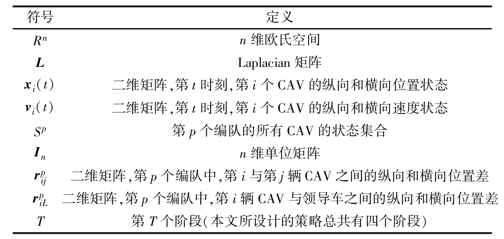
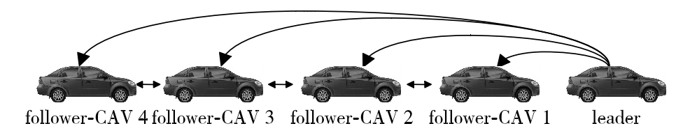
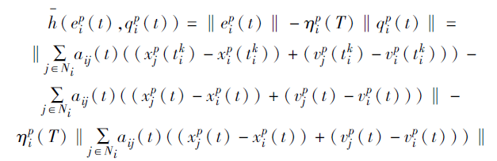
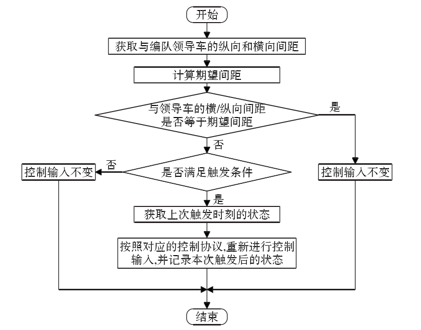
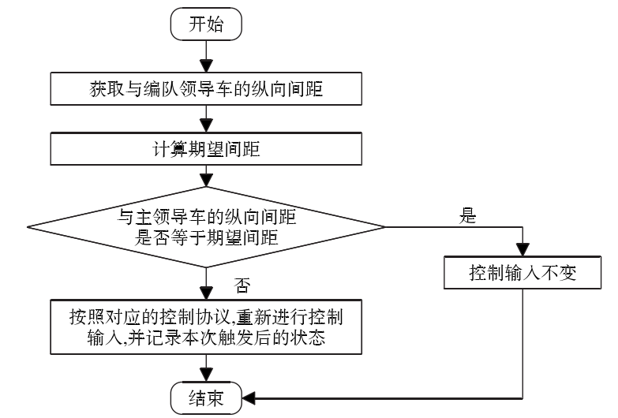
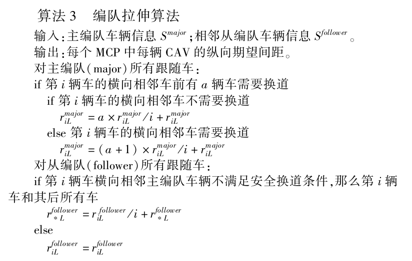

# Note

> Written By: 思思不羡仙
> Date: 2022.07.28-2022.07.29

**论文：基于事件触发机制的双编队车辆换道决策模型**

> 由于Motif第二部分模拟出现Bug，先放这部分的笔记上来
>
> 总结：
>
> 1. 模拟使用是for循环，没有直接使用矩阵运算，导致速度过慢
> 2. 对于公式定义及算法定义理解不透彻

## 一、摘要

**概述：** 针对双编队系统，利用事件触发机制和多智能体一致性的思想，设计了一种基千组合测散方式的事件触发器以及编队内和编队间的一致性协议；设计了一种基于事件触发机制的双编队车辆换道决策模型

**作用：** 保证双编队系统达到稳定状态，又能降低控制器的更新频率、减少车辆能耗；帮助需要换道的CAV能够同时自主切换到目标车道

## 二、预备知识

### 2.1 图论及定义

图论相关知识略

### 2.2 问题描述

**通信方式：** 领导车与所有跟随车单向通信，跟随车与前后相邻的跟随车双向通信

假设有一个领导CAV和n个跟随CAV，需要设计多辆CAV在双MCP（multi-CAV platoon）编队中主动切换编队的策略

宏观上：在两条平行道路上，有两个MCP，选出一个major-MCP和一个follower-MCP

微观上（控制层）：m-MCP领导车发送给自己的跟随者还会发送信息给f-MCP的领导车

## 三、策略设计

### 3.1 事件触发器设计

定义智能体$i$在$t$时刻的组合状态：

$$
q_i^p=\sum_{j=1}^na_{ij}(t)[(x^p_j(t)-x^p_i(t))+(v^p_j(t)-v^p_i(t))]
$$

其中误差定义为：

$$
e^p_i(t)=q_i^p(t)-q^p_i(t)
$$

有两个假设：

$(A,B)$是稳定的、无向通信图$G$是连通的

定义触发条件如下：

### 3.2 编队内分布式控制协议的设计

$$
u^p_i=-\sum_{j\in N_i(s(t))}a_{ij}(t)[\gamma_1(x_i^p(t^k_i)-x^p_j(t^k_i)-r_{ij}^p(T))+\gamma_2(v_i^p(t^k_i)-v^p_j(t^k_i))]-\pi^p_i[\gamma_3(x_i^p(t_i^k)-x_L^p(t^k_i)-r^p_{iL}(T))+\gamma_4(v_i^p(t^k_i)-v^p_L(t^k_i))]
$$

其中$t_i^k$表示编队内第$i$个CAV在地$k$次触发的时刻，需要注意的是，当多智能体编队的网络拓扑切换时，定义分段定常切换信号$s(t):[t_0,+\infin)\rightarrow P$，该信号表示系统的拓扑结构改变，令$P=\{1,2,..,m\}$，那么切换信号下所有可能的切换拓扑用$\{G_1,G_2,...,G_m\}$表示

### 3.3 编队间分布式控制协议的设计

在决策模型的第一阶段会让主从领导车形成一种横向间距固定且纵向间距为0的状态，控制协议如下：

$$
u_L^p(t_L)=-\pi^p_L[\gamma_5(x_L^{follower}(t_L)-x_L^{major}(t_L)-r_L(T))+\gamma_6(v_L^{follower}(t_L)-v_L^{major}(t_L))]
$$

### 3.4 自主换道策略设计

#### 3.4.1 初次调整阶段

#### 3.4.2 拉伸编队阶段

在双MCP模型中，为了使需要换道的车辆能够安全的切换车道，必须保证在另一编队的横向相邻位置能够为其拉开一定的安全间距，在这个阶段，每个编队的领导车都匀速行驶，策略如下：

#### 3.4.3 换道阶段

每个MCP编队中的领导CAV匀速运动，需要切换编队的CAV通过当前编队的领导车的转接，与目标编队的领导车建立通信，并切断与旧领导车的通信链路以完成通信拓扑的主动切换，单MCP编队内的跟随CAV调整其与领导车的横向期望间距为0，纵向不变，在3.4.1的决策下运行

#### 3.4.4 再次调整编队阶段

每个MCP编队的领导CAV匀速运动，单MCP内的跟随CAV调整其与相邻的CAV的纵向期望间距为$d$，横向期望间距为0，在3.4.1的决策下运行

## 四、仿真实验

> 分为四个阶段进行，但实际可以融合起来，见B部分笔记
