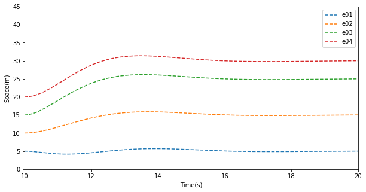

# Note

> Written By: 思思不羡仙
> Date: 2022.08.01-2022.08.02

## Part1.补充

首先是上次实验漏画的两幅控制信号输入的图片，表示了车辆速度变化控制信号的输入：


## Part2.编队拉伸

首先是构建变换算法：

```python
s_mat = np.ones((2, 4))
s_mat[0][3] = 0
s_mat[1][2] = 0
s_mat[1][0] = 0
s_mat[1][2] = 0
# 主编队
for i in range(1, 4):
    s_sum = 0
    for j in range(0, i):
        s_sum += s_mat[0][j]
    if s_mat[0][i]:
        r_mat[0][i] = s_sum * r_mat[0][i] / (i + 1) + r_mat[0][i]
    else:
        r_mat[0][i] = (s_sum - 1) * r_mat[0][i] / (i + 1) + r_mat[0][i]
# 附编队
for i in range(0, 4):
    if r_mat[0][i][0] >= r_mat[1][i][0]:
        r_mat[1][i] = r_mat[1][i] / (i + 1) + r_mat[0][i]
print(r_mat)
```

而后进行常规话图即可：




## Part3.编队切换

这里的编队切换实际是让编队跟随车重新匹配$xL$和$vL$，此处为了方便模拟，直接使用Part2最后保存的状态进行模拟操作：


## Part4.编队收缩

此部分与前部分类似，仅仅是期望矩阵更改后重新跑一次变换函数，这里将上一部分的图像一起融入更有助于了解编队如何收缩：


