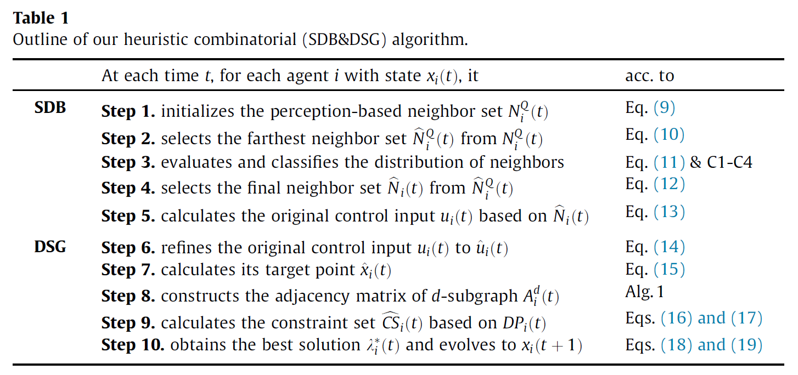
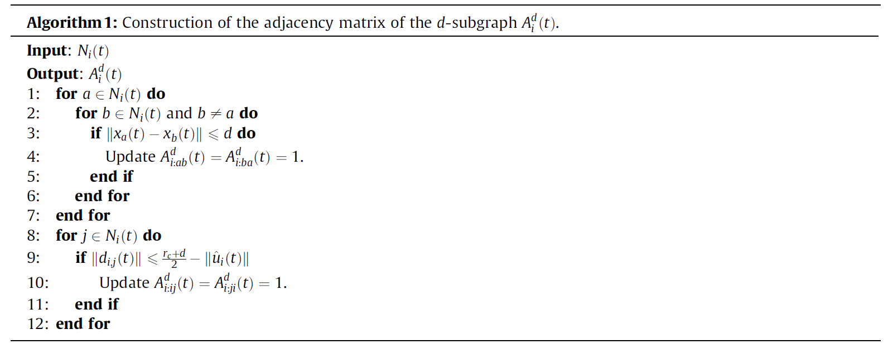
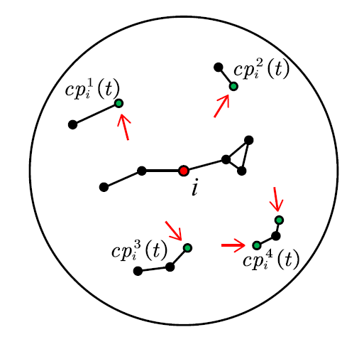

# Note

> Written By: 思思不羡仙
> Date: 2022.08.03-2022.08.04

**论文：Fast distributed consensus seeking in large-scale and high-density multi-agent systems with connectivity maintenance**

## 一、概述

网络拓扑在MAS共识理论中起着重要的作用，有限制的信息在远距离智能体交换会阻碍多智能体系统的收敛，这样会使多智能体系统分裂成多个子集群

为了解决这个问题，连通性和收敛性是相互约束的，具体来说就是为了确保连通性，在达成共识的过程中会相互约束，导致他们达成共识的速度趋于缓慢或是无法达成共识，而减少每个代理的约束来加速系统收敛会破环系统的连接使得其裂解为多个集群

因此需要设计一个在无向和时变通行网络下的分布式共识算法，该算法必须保持连接且确保收敛性，在大规模且高阶的拓扑网络中，一个系统可能裂解为多个子集群，因此需要在智能体达成共识的过程中，算法既可以使系统保持收敛，同时保持连通性

## 二、前置理论

### 1. DT分布式共识算法

基线共识算法是：
$$
x_i(t+1)=x_i(t)+u_i(t)
$$
其中：$u_i(t)$是在时间$t$处的控制输入，我们将基线共识控制输入$u'_i(t)$（为了不与$u_i(t)$定义矛盾）定义为：
$$
u'_i(t)=\delta \sum_{j\in N_i(t)}d_{i,j}(t)
$$
其中$\delta$为超参，假设每个时间$t$都可以保证连通性，如果$\delta$设置为一个合适的值，所有的智能体将收敛到一个共同的状态。 具体来说，如果所有代理都满足下式子，则定义MAS达成共识：
$$
\lim_{i\to \infty }||x_i(t)-x_j(t)||=0
$$
然而，假设一直保证连通是一种理想的情况。 在多数情况下，在没有任何约束的情况下很难保持网络拓扑的连通性。，因此，如果整体连通性中断，则无法保证收敛

### 2. 约束集描述

约束集用于维护DT MAS中的连通性，令$CS_i(t)$为智能体$i$在$t$时刻的约束，这要求智能体$i$在时间$t+1$必须达到$CS_i(t)$的约束，也就是$x_i(t+1)\in CS_i(t)$，$CS_i(t)$的定义与其邻居$N_i(t)$的信息有关，其中$B(p,r)$表示一个中心为$p$半径为$r$的封闭圆盘：
$$
CS_i(t)=\bigcap_{j\in N_i(t)}B\begin{pmatrix}\begin{align}\frac{x_i(t)+x_j(t)}{2},\frac{r_c}{2}\end{align}\end{pmatrix}
$$
如果智能体$i$的感知范围内的邻居数量显着，则$CS_i(t)$将很小或是为空集，因此系统不能有效收敛，为了便于描述$CS_i$的使用，我们提出以下新的动态方程：
$$
x_i(t+1)=(1-\lambda_i(t))\cdot x_i(t)+\lambda_i(t)\cdot\hat{x}_i(t)
$$
其中$\hat{x}_i(t)$是智能体$i$的目标点，$x_i(t+1)$属于从$x_i(t)$到$\hat{x}_i(t)$线上的点，由$\lambda_i(t)$决定，因为我们的目标是促使MAS尽快收敛，$\lambda_i(t)$被定义为以下问题的解：
$$
\begin{align}
\textrm{max}& &\lambda_i(t)\\
\textrm{s.t.}& &\lambda_i(t)\le1,x_i(t+1)\in CS_i(t)
\end{align}
$$

## 三、构建算法

### 1. 算法概要

### 2. SDB共识算法

在此算法中，每个智能体选择的邻居要少得多，并且每个智能体使用不同的调整因子，每个智能体还将选定的邻域信息分成相等的部分，并获得一个折衷控制输入，$angle(\vec{\alpha},\vec{\beta})$表示向量$\vec{\alpha}$逆时针旋转到向量$\vec{\beta}$的角度，这两个向量相同起点

为了简化算法，将每个智能体的感知通信区域划分为四个扇区（象限），用$N_i^1(t),N_i^2(t),N_i^3(t),N_i^4(t)$表示每个扇区中的邻居集
$$
N_i^Q(t)=\begin{Bmatrix}\begin{align}
j\in N_i(t)|(Q-1)\cdot \frac{\pi}{2}\le angle(v,d_{ij}(t)<Q\cdot \frac{\pi}{2})
\end{align}
\end{Bmatrix}
,Q\in \{1,2,3,4\}
$$
其中$v=(1,0)$，$Q$为扇区索引，另外定义$N_i^1,N_i^4$为相邻邻居集（其余同理）

为了加速收敛，每个智能体从其四个扇区中选择最远的邻居之一作为控制输入的参考， 但是，每个扇区中可能有几个最远的邻居并存，解决这个问题可以遵循： 首先，每个扇区中最远邻居集的定义由下式给出：
$$
\hat{N}_i^Q(t)=\begin{Bmatrix}\begin{align}k|k \in \arg \max_{j\in N_i^Q(t)}d_{i,j}(t)\end{align}
\end{Bmatrix},Q=\{1,2,3,4\}
$$
为了方便我们用$T^i(t)\in\{0,1\}^{1\times4}$来表示一个四维行向量，其元素定义为：
$$
T^i_Q(t)=\left\{\begin{matrix}
1,|N_i^Q|\neq0 \\
0,other
\end{matrix}\right.,Q\in\{1,2,3,4\}
$$
$T^i(t)$是一个标记，用于记录是否有智能体存在于智能体$i$的扇区中，如果存在，其为1否则为0

以下有4种情况：

| $||T^i(t)||^2$的取值 | 如何选择？                                                   |
| -------------------- | ------------------------------------------------------------ |
| 1                    | 表示智能体$i$的邻居存在于一个小范围内， 因此，智能体$i$从最远的邻居集中随机选择一个即可 |
| 2                    | 当$T^i(t)\cdot[1,-1,1,-1]^T\neq0$，表明智能体$i$的邻居仅在两个对角扇区中，因此，智能体$i$从两个对角扇区的每一个中随机选择一个邻居 |
| 2                    | 当$T^i(t)\cdot[1,-1,1,-1]^T=0$，表明智能体$i$的最远邻居分布在两个相邻的最远邻居集中，智能体$i$选择$m_1\in\hat{N}_i^{(1)}(t)$与$m_2\in\hat{N}_i^{(2)}(t)$，且$m_1$和$m_2$需要满足是其区间内最大的 |
| 3/4                  | 表示智能体$i$在局部区域中处于相对中心位置，因此，智能体$i$从每个扇区中随机选择一个最远的邻居即可 |

如果每个智能体选择最远的邻居来构造控制输入，在系统拓扑达到完全连通之前，可以加速系统收敛，然而，系统在实现完全连通后很难收敛到一个共同的平衡，因此，智能体必须改变其动力学才可使系统保持收敛，我们使智能体能够以最少计算量知道控制策略的切换时间，每个智能体控制信号输入如下：
$$
u_i(t)=\left\{\begin{matrix}\begin{align}
&\frac{1}{|\hat{N_i}(t)|}\cdot\sum_{j \in \hat{N_i}(t)}d_{i,j}(t)&,|N_i(t)|<n-1
 \\
&\frac{1}{|N_i(t)|}\cdot\sum_{j \in \hat{N_i}(t)}d_{i,j}(t)&,otherwise
\end{align}\end{matrix}\right.
$$
此方法由于在邻居达到$n-1$前，最多选择四个邻居来计算控制输入（而不是全部），因此会比传统的基线方程大大减小计算量

### 2. DSG共识算法

首先，我们细化从方程式派生的原始控制输入:
$$
\hat{u}_i(t)=\textrm{min}\begin{Bmatrix}\begin{align} \frac{r_c-d}{2||u_i(t)||},1 \end{align}\end{Bmatrix}\cdot u_i(t)
$$
其中$d\in[0,r_c)$在收敛演化过程中是静态的，$\hat{u}_i(t)$与$u_i(t)$是相同方向的，但$\hat{u}_i(t)$的长度被限制在$(0,\frac{r_c-d}{2}]$，则目标点可定义为：
$$
\hat{x}_i(t)=x_i(t)+\hat{u}_i(t)
$$
我们使用$A_i^d(t)\in \{0,1\}^{n\times n}$来表示智能体$i$的$d-$子图邻接矩阵，每个智能体控制输入的上限是$\frac{r_c-d}{2}$，因此只要两个邻居节点在时间$t$时没有大于$d$，那么他们便不会断开，以下是构造该矩阵的算法：

我们需要$A_i^d(t)$被连接减少对代理的连接约束，然而在多数情况下$A_i^d(t)$是一个不连接或是多连接的的组件，假设$A_i^d(t)$有一个连接组件$q\in \N^+$，其中$q\in[1,...,n]$，如果$A_i^d(t)$是连接的，那么$q=1$，将包括智能体$i$的连接组件表示为$cp^0_i(t)$，剩余的连通分量为$cp^1_i(t),...,cp^{q-1}_i(t)$，特别地，$cp^1_i(t),...,cp^{q-1}_i(t)$在$A_G(t)$种是相互连接的，同时，对于任意$cp_i^p$是在$G(t)$中相互不连接的子图，如果智能体$i$可以确保与每个连接组件中的智能体连接，则智能体$i$的组件内连接得到保证从而整体连通性也得到了保证，对其有以下定义：
$$
DP_i(t)=\bigcup_{l=1}^{q-1}\begin{Bmatrix}
\arg \max_{j\in cp_i^l(t)}||d_{i,j}(t)||
\end{Bmatrix}
$$
如下图，如果智能体$i$的邻居为$DP_i(t)$，那么计算误差将会使得多个最近的邻居被加入到$DP_i(t)$中，故需要设置另外一个条件：如果$i$想将$j$加入，那么$i$也需要成为$j$的最近邻居才可，也就是需要无向连接（双边连接）

我们定义基于$DP_i(t)$的构造集合$\widehat{CS_i}(t)$为：
$$
\widehat{CS_i}(t)=\bigcap_{j\in DP_i(t)}B\begin{pmatrix}
\begin{align}
\frac{x_i(t)+x_j(t)}{2},\frac{r_c}{2}
\end{align}
\end{pmatrix}
$$
其中$B(C_{ij},\frac{r_c}{2})$为一个圆盘，$C_{ij}$是$DP_i(t)$中的中心点，因此$x_i\in \widehat{CS_i}(t)$可以被获得，则智能体$i$在下一时段的位置可以被约束在$\widehat{CS_i}(t)$中，随后可以获得解$\lambda^*_i(t)$：
$$
\begin{align}
\textrm{max}& &\lambda_i(t)\\
\textrm{s.t.}& &\lambda_i(t)\le1,x_i(t+1)\in \widehat{CS_i}(t)
\end{align}
$$
将系数变换可得：
$$
x_i(t+1)=(1-\lambda^*_i(t))\cdot x_i(t)+\lambda^*_i(t)\cdot\hat{x}_i(t)
$$

## 四、实验部分

仍在研究……